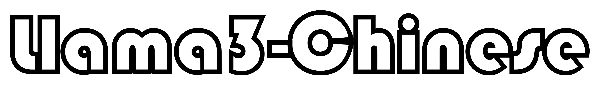

<p align="left">
    中文</a>&nbsp ｜ &nbsp<a href="README.md">English</a>
</p>
<br><br>

<p align="center">
<a href='https://huggingface.co/spaces/zhichen'>

</a>
</p>

<div align="center">
  <p align="center">
    <h3> Llama3-Chinese </h3>

<p align="center">
      <a href='https://huggingface.co/zhichen'>
        
      </a>
      <a href='https://modelscope.cn/profile/seanzhang'>
        
      </a>
      <br>
      <a href=href="https://github.com/seanzhang-zhichen/llama3-chinese/stargazers">
        
      </a>
      <a href="https://github.com/seanzhang-zhichen/llama3-chinese/blob/main/LICENSE">
        
      </a>
</p>
</div>


## 介绍

**Llama3-Chinese**是**以Meta-Llama-3-8B为底座**，使用 [DORA](https://arxiv.org/pdf/2402.09353.pdf) + [LORA+](https://arxiv.org/pdf/2402.12354.pdf) 的训练方法，在50w高质量中文多轮SFT数据 + 10w英文多轮SFT数据 + 2000单轮自我认知数据训练而来的大模型。

**Github:** [https://github.com/seanzhang-zhichen/llama3-chinese](https://github.com/seanzhang-zhichen/llama3-chinese)


## 模型下载

| Model             | Download  |
|:-------------------:|:-----------:|
| Meta-Llama-3-8B        |[ 🤗 HuggingFace](https://huggingface.co/meta-llama/Meta-Llama-3-8B) [  🤖 ModelScope](https://modelscope.cn/models/LLM-Research/Meta-Llama-3-8B)|
| Llama3-Chinese-Lora           |[ 🤗 HuggingFace](https://huggingface.co/zhichen/Llama3-Chinese-Lora) [  🤖 ModelScope](https://modelscope.cn/models/seanzhang/Llama3-Chinese-Lora)|
| Llama3-Chinese (合并好的模型)           |[ 🤗 HuggingFace](https://huggingface.co/zhichen/Llama3-Chinese) [  🤖 ModelScope](https://modelscope.cn/models/seanzhang/Llama3-Chinese)|


## 合并LORA模型（可跳过）

1、下载 [Meta-Llama-3-8B](https://modelscope.cn/models/LLM-Research/Meta-Llama-3-8B)

```bash
git clone https://www.modelscope.cn/LLM-Research/Meta-Llama-3-8B.git
```

2、下载[Llama3-Chinese-Lora](https://www.modelscope.cn/models/seanzhang/Llama3-Chinese-Lora)

**From ModelScope**
```bash
git lfs install
git clone https://www.modelscope.cn/seanzhang/Llama3-Chinese-Lora.git
```

**From HuggingFace**
```bash
git lfs install
git clone https://huggingface.co/zhichen/Llama3-Chinese-Lora
```

3、合并模型

```bash
python merge_lora.py \
    --base_model path/to/Meta-Llama-3-8B \
    --lora_model path/to/lora/Llama3-Chinese-Lora  \
    --output_dir ./Llama3-Chinese
```

## 下载 Llama3-Chinese（合并好的模型）

**From ModelScope**
```bash
git lfs install
git clone https://www.modelscope.cn/seanzhang/Llama3-Chinese.git
```

**From HuggingFace**
```bash
git lfs install
git clone https://huggingface.co/zhichen/Llama3-Chinese
```


## 推理

```python
from transformers import AutoTokenizer, AutoModelForCausalLM

model_id = "zhichen/Llama3-Chinese"

tokenizer = AutoTokenizer.from_pretrained(model_id)
model = AutoModelForCausalLM.from_pretrained(model_id, torch_dtype="auto", device_map="auto")

messages = [
    {"role": "system", "content": "You are a helpful assistant."},
    {"role": "user", "content": "你好"},
]

input_ids = tokenizer.apply_chat_template(
    messages, add_generation_prompt=True, return_tensors="pt"
).to(model.device)

outputs = model.generate(
    input_ids,
    max_new_tokens=2048,
    do_sample=True,
    temperature=0.7,
    top_p=0.95,
)
response = outputs[0][input_ids.shape[-1]:]
print(tokenizer.decode(response, skip_special_tokens=True))
```

## 命令行推理

```bash
python cli_demo.py --model_path zhichen/Llama3-Chinese
```

## web推理

```bash
python web_demo.py --model_path zhichen/Llama3-Chinese
```


## vllm web 推理

1、使用[vllm](https://github.com/vllm-project/vllm)部署模型

```bash
python -m vllm.entrypoints.openai.api_server --served-model-name Llama3-Chinese --model ./Llama3-Chinese(换成你自己的合并后的模型路径)
```

2、在命令行执行

```bash
python vllm_web_demo.py --model Llama3-Chinese
```


## 训练数据集

[匠数科技大模型sft数据集](https://modelscope.cn/datasets/deepctrl/deepctrl-sft-data)


## LICENSE

本项目仅可应用于研究目的，项目开发者不承担任何因使用本项目（包含但不限于数据、模型、代码等）导致的危害或损失。详细请参考[免责声明](https://github.com/seanzhang-zhichen/Llama3-Chinese/blob/main/DISCLAIMER)。

Llama3-Chinese项目代码的授权协议为 [The Apache License 2.0](./LICENSE)，代码可免费用做商业用途，模型权重和数据只能用于研究目的。请在产品说明中附加Llama3-Chinese的链接和授权协议。

## Citation

如果你在研究中使用了Llama3-Chinese，请按如下格式引用：

```latex
@misc{Llama3-Chinese,
  title={Llama3-Chinese},
  author={Zhichen Zhang, Xin LU, Long Chen},
  year={2024},
  howpublished={\url{https://github.com/seanzhang-zhichen/llama3-chinese}},
}
```


## Acknowledgement

[meta-llama/llama3](https://github.com/meta-llama/llama3)
<br>
[hiyouga/LLaMA-Factory](https://github.com/hiyouga/LLaMA-Factory)


## Star History

[](https://star-history.com/#seanzhang-zhichen/Llama3-Chinese&Date)

